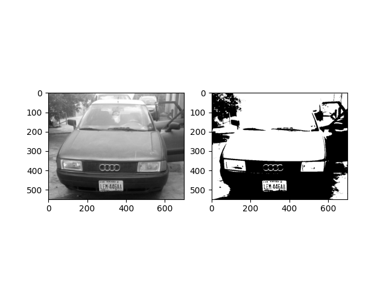
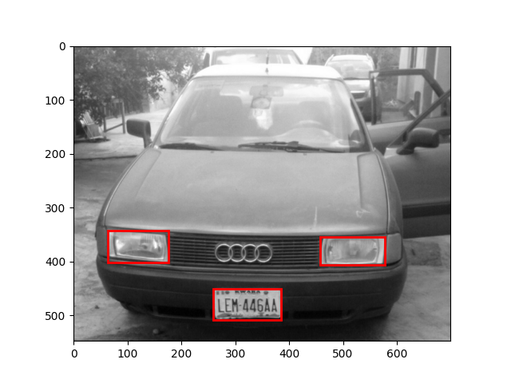
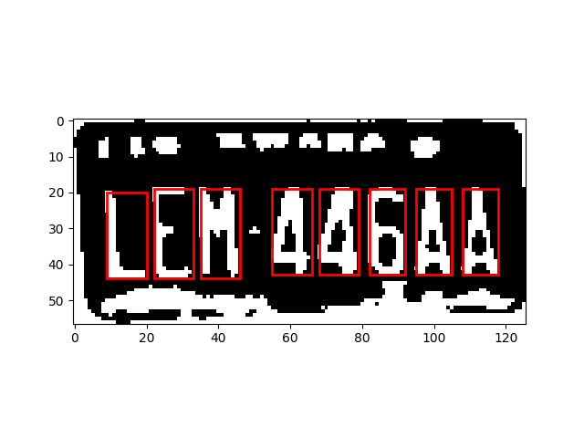

# ALPR - Results

## Overview

Automatic License Plate Recognition system using traditional computer vision and machine learning techniques.

## Algorithm Pipeline

### Step 1: License Plate Detection

Grayscale and binary image transformation showing the preprocessing stage for plate localization.

### Step 2: Connected Component Analysis

Connected component detection and filtering to isolate the license plate region from the vehicle image.

### Step 3: Character Segmentation

Individual character extraction and 20x20 pixel normalization for recognition input.

## Model Performance

**Character Recognition Model**: Support Vector Classifier (SVC)
- **Training Data**: 20x20 pixel images of digits (0-9) and uppercase letters (A-Z)
- **Validation**: 4-fold cross-validation
- **Accuracy**: Competitive performance on character classification

## Processing Steps

1. **Image Preprocessing**: Convert to grayscale and binary representation
2. **Plate Localization**: Connected component analysis with size and position filtering
3. **Character Segmentation**: Extract individual characters from plate region
4. **Normalization**: Resize characters to 20x20 pixels
5. **Recognition**: SVC prediction for each character
6. **Output**: Complete license plate string

## Key Findings

- Binary thresholding effectively isolates high-contrast plate regions
- Position-based filtering (bottom region of image) reduces false positives
- Size-based component filtering removes noise while preserving characters
- 20x20 normalization provides consistent input for SVC classifier
- Traditional ML approach achieves reliable character recognition without deep learning
