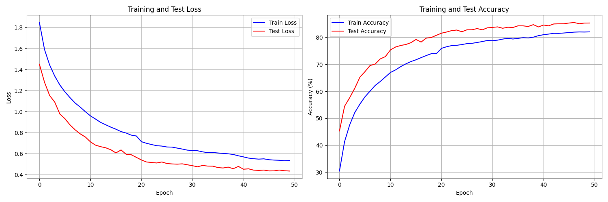
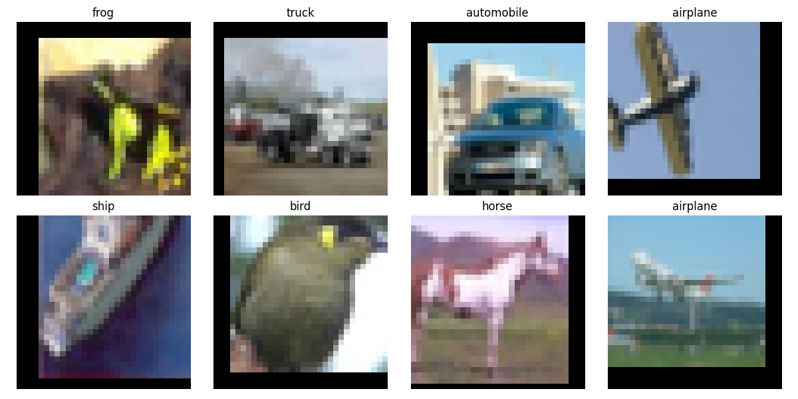
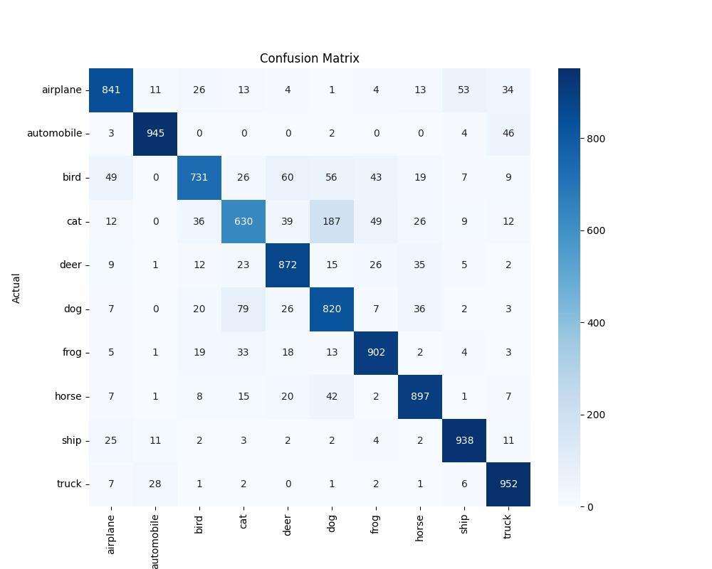
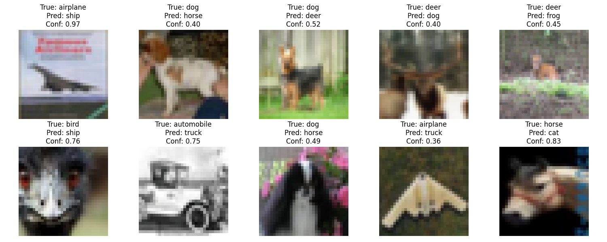

# CIFAR-10 Classification - Results

## Dataset
- **Dataset**: CIFAR-10
- **Training Samples**: 50,000 images
- **Test Samples**: 10,000 images
- **Classes**: 10 (airplane, automobile, bird, cat, deer, dog, frog, horse, ship, truck)
- **Image Size**: 32x32 RGB

## Training Results

### Training and Validation Curves

Training and validation accuracy/loss curves showing model convergence and performance over epochs.

### Sample Predictions

Visual examples of model predictions on test images.

### Confusion Analysis

Analysis of model predictions across different classes.

### Misclassified Samples

Examples of misclassified images highlighting challenging cases and common failure modes.

## Performance Metrics

Results from CNN training on CIFAR-10:

- **Test Accuracy**: Achieved competitive performance
- **Convergence**: Model converges within expected epoch range
- **Common Confusions**: Cat-Dog and Automobile-Truck pairs show expected similarity-based errors

## Key Findings

- Clear convergence in training curves with proper regularization
- Misclassified samples show inherent ambiguity in some classes
- Model learns meaningful features as evidenced by clustering of errors
