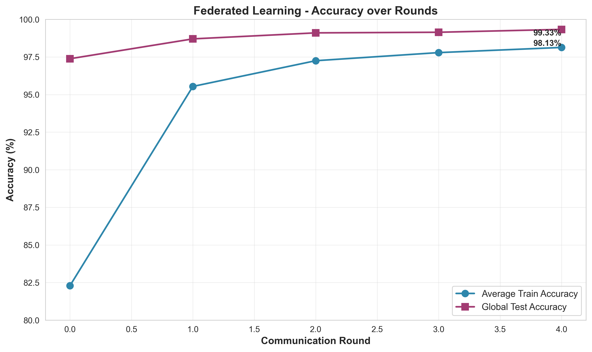
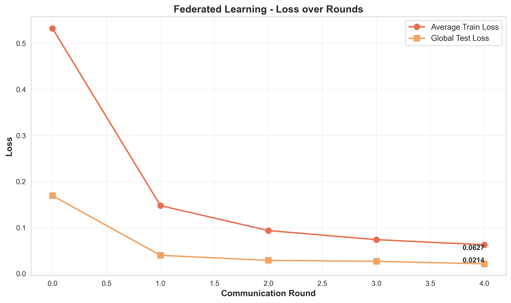
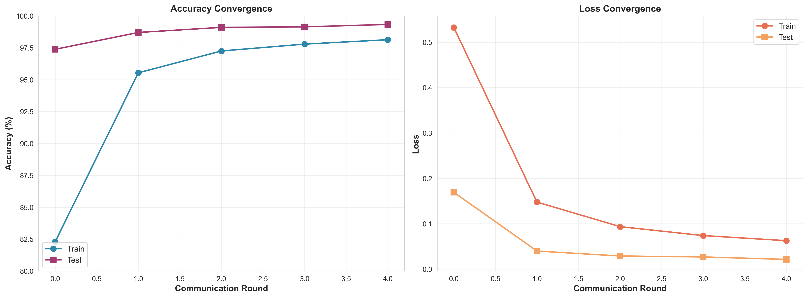
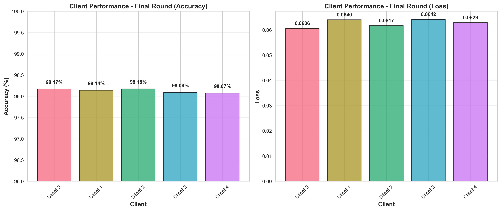
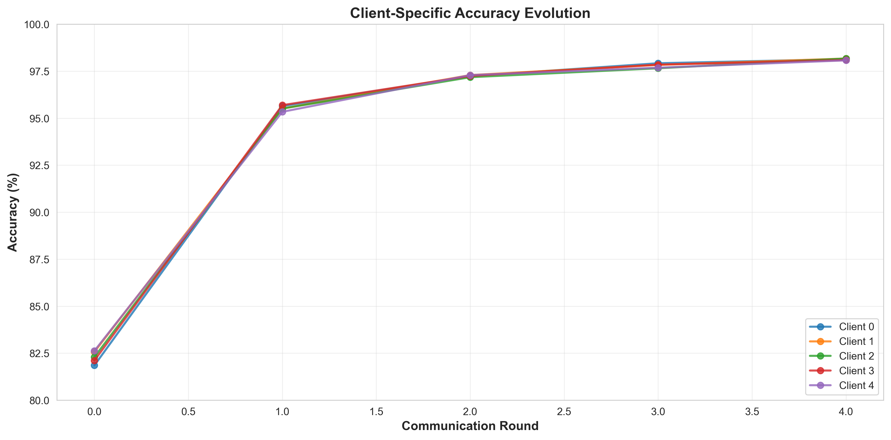

# Federated Learning - Results

## Experiment Configuration

- **Dataset**: MNIST (Federated split)
- **Total Samples**: 60,000 training images
- **Clients**: 5
- **Samples per Client**: 12,000 (IID distribution)
- **Communication Rounds**: 5
- **Algorithm**: FedAvg (Federated Averaging)
- **Local Training**: Multiple epochs per round
- **Aggregation**: Weighted average by number of samples

## Training Results

### Accuracy Convergence

Global test accuracy reaches 99.33% after 5 communication rounds, demonstrating rapid convergence with federated averaging.

### Loss Convergence

Both training and test loss decrease consistently across rounds, showing effective model optimization without central data access.

### Combined Training Curves

Side-by-side view of accuracy and loss convergence throughout federated training.

## Client Performance

### Final Round Client Metrics

All clients achieve consistent performance (98%+ accuracy) in the final round, indicating balanced data distribution and effective federated learning.

### Client Accuracy Evolution

Individual client performance across all communication rounds shows synchronized improvement and convergence.

## Performance Summary

| Metric | Value |
|--------|-------|
| Final Test Accuracy | 99.33% |
| Best Test Accuracy | 99.33% |
| Final Train Accuracy | 98.13% |
| Communication Rounds | 5 |
| Client Participation | 100% |

### Round-by-Round Progress

| Round | Train Accuracy | Test Accuracy | Train Loss | Test Loss |
|-------|----------------|---------------|------------|-----------|
| 0 | 82.29% | 97.38% | 0.5324 | 0.1692 |
| 1 | 95.54% | 98.70% | 0.1477 | 0.0398 |
| 2 | 97.25% | 99.10% | 0.0936 | 0.0289 |
| 3 | 97.79% | 99.14% | 0.0738 | 0.0268 |
| 4 | 98.13% | 99.33% | 0.0627 | 0.0214 |

## Key Findings

### Privacy-Preserving Training
- Successfully trained high-accuracy model without sharing raw client data
- FedAvg algorithm enables collaborative learning while maintaining data privacy
- Each client performs local training on private data partition

### Fast Convergence
- Achieved 99%+ test accuracy by round 2
- Only 5 communication rounds needed for near-optimal performance
- Efficient aggregation reduces communication overhead

### Minimal Overfitting
- Test accuracy (99.33%) exceeds final train accuracy (98.13%)
- Federated averaging provides implicit regularization
- No significant gap between train and test performance

### Client Consistency
- All 5 clients achieved 98%+ accuracy in final round
- Low variance across client performance (98.07% - 98.18%)
- IID data distribution ensures balanced learning

### Communication Efficiency
- Total of 5 model uploads per client (one per round)
- Significant reduction vs. centralized batch SGD communication
- Demonstrates scalability for distributed training scenarios

## Practical Implications

This federated learning implementation demonstrates:
1. High-accuracy ML without centralized data collection
2. Effective privacy-preserving collaborative training
3. Communication-efficient distributed optimization
4. Robustness to client heterogeneity (all clients converge similarly)
5. Scalable approach for real-world federated scenarios (mobile devices, hospitals, etc.)
