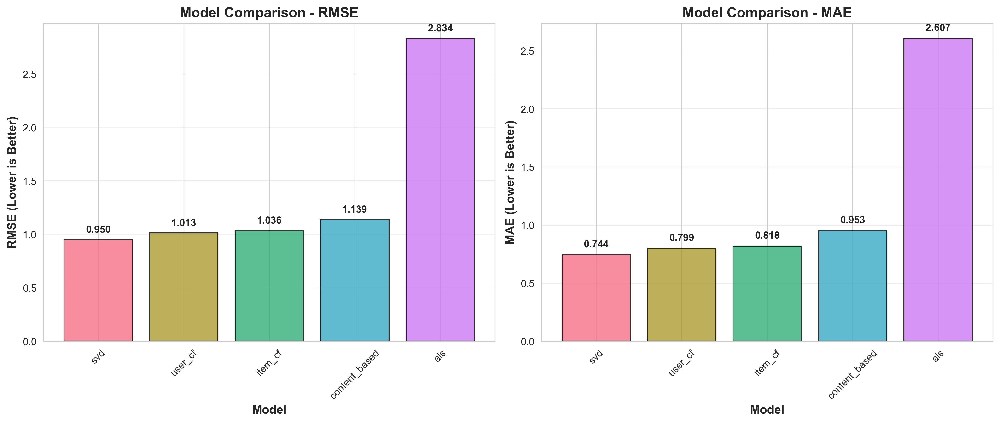

# Recommendation System


Multi-algorithm recommendation system supporting collaborative filtering, content-based filtering, matrix factorization, and neural networks.

## Overview

This project implements recommendation algorithms for movies, music, and e-commerce. It includes user-based and item-based collaborative filtering, content-based filtering with TF-IDF, matrix factorization (SVD, ALS), neural collaborative filtering, and hybrid methods. Provides REST API and web interface.

## Features

- Collaborative filtering (user-based, item-based)
- Content-based filtering (TF-IDF)
- Matrix factorization (SVD, ALS)
- Neural collaborative filtering (NCF) with PyTorch
- Hybrid recommendations (weighted, rank fusion)
- Multi-domain support (movies, music, e-commerce)
- FastAPI REST API
- Evaluation metrics (RMSE, MAE, Precision@K, NDCG@K)
- Docker deployment

## Installation

```bash
pip install -r requirements.txt
```

Requirements: Python 3.8+, PyTorch 1.9+, scikit-learn, pandas, surprise, fastapi

## Quick Start

### Train Model

```bash
# Collaborative filtering
python train.py --algorithm collaborative --data movielens-100k

# Matrix factorization
python train.py --algorithm svd --data movielens-100k --factors 100

# Neural collaborative filtering
python train.py --algorithm ncf --data movielens-100k --epochs 20
```

### Generate Recommendations

```bash
python recommend.py --user-id 123 --model models/svd_model.pkl --top-k 10
```

### Start API Server

```bash
uvicorn api.main:app --host 0.0.0.0 --port 8000

# Or with Docker
docker-compose up
```

## Usage

```python
from src.models import CollaborativeFiltering, MatrixFactorization
from src.data import DatasetLoader

# Load data
loader = DatasetLoader('movielens-100k')
train_data, test_data = loader.load_and_split()

# Train collaborative filtering
cf = CollaborativeFiltering(method='user-based', k=20)
cf.fit(train_data)
predictions = cf.recommend(user_id=123, top_k=10)

# Train SVD
svd = MatrixFactorization(algorithm='svd', n_factors=100)
svd.fit(train_data)
predictions = svd.predict(user_id=123, item_id=456)
```

## Algorithms

### Collaborative Filtering

**User-Based** - Find similar users and recommend items they liked
**Item-Based** - Find similar items to those user has liked

Similarity metrics: Cosine, Pearson correlation, Jaccard

### Content-Based Filtering

Uses item features (text descriptions, genres, tags) and TF-IDF to find similar items.

### Matrix Factorization

**SVD** - Singular Value Decomposition for latent factor models
**ALS** - Alternating Least Squares for implicit feedback

### Neural Collaborative Filtering

Deep learning model with embedding layers for users and items, followed by MLP layers.

```python
class NCF(nn.Module):
    def __init__(self, num_users, num_items, embed_dim, layers):
        self.user_embedding = nn.Embedding(num_users, embed_dim)
        self.item_embedding = nn.Embedding(num_items, embed_dim)
        self.mlp = MLP(embed_dim * 2, layers)
```

### Hybrid Methods

**Weighted** - Combine predictions from multiple models with learned weights
**Rank Fusion** - Combine ranked lists using Borda count or reciprocal rank

## API Endpoints

```bash
# Get recommendations
POST /recommend
{
  "user_id": 123,
  "top_k": 10,
  "algorithm": "svd"
}

# Rate item
POST /rate
{
  "user_id": 123,
  "item_id": 456,
  "rating": 4.5
}

# Get similar items
GET /similar/{item_id}?top_k=10
```

## Datasets

- **MovieLens**: 100K, 1M, 10M ratings
- **Last.fm**: Music listening history
- **Amazon**: Product reviews
- **Custom**: Load from CSV with (user_id, item_id, rating)

## Evaluation

```python
from src.evaluation import evaluate_model

metrics = evaluate_model(
    model=model,
    test_data=test_data,
    metrics=['rmse', 'mae', 'precision@10', 'ndcg@10']
)

print(f"RMSE: {metrics['rmse']:.4f}")
print(f"Precision@10: {metrics['precision@10']:.4f}")
```

Metrics:
- **Rating Prediction**: RMSE, MAE
- **Ranking**: Precision@K, Recall@K, NDCG@K, MAP@K
- **Diversity**: Intra-list diversity, coverage, novelty

## Configuration

```yaml
data:
  dataset: movielens-100k
  split_ratio: 0.8
  min_ratings: 5

model:
  algorithm: svd
  n_factors: 100
  n_epochs: 20
  learning_rate: 0.005
  regularization: 0.02

api:
  host: 0.0.0.0
  port: 8000
  workers: 4
```

## Project Structure

```
Recommendation-System/
├── src/
│   ├── data/            # Data loaders and preprocessors
│   ├── models/          # Recommendation algorithms
│   ├── evaluation/      # Metrics
│   └── api/             # REST API
├── tests/               # Unit tests
├── configs/             # Configuration files
├── models/              # Saved models
├── data/                # Datasets
├── train.py             # Training script
└── recommend.py         # Recommendation script
```

## Docker Deployment

```yaml
# docker-compose.yml
services:
  api:
    build: .
    ports:
      - "8000:8000"
    volumes:
      - ./models:/app/models
      - ./data:/app/data
    environment:
      - MODEL_PATH=/app/models/svd_model.pkl
```

## Testing

```bash
pytest tests/
```

## Implementation Notes

Uses surprise library for collaborative filtering and matrix factorization. PyTorch for neural models. FastAPI for REST API with automatic OpenAPI documentation.

Collaborative filtering uses KNN with cosine similarity. Matrix factorization uses SGD or ALS optimization. NCF uses binary cross-entropy loss for implicit feedback.

Handles cold start via content-based recommendations or popularity-based fallbacks. Supports incremental updates for online learning.

## Results

Experimental results on MovieLens 100K dataset (943 users, 1,682 movies, 100K ratings):

| Model | RMSE | MAE | Coverage |
|-------|------|-----|----------|
| SVD | 0.950 | 0.744 | 100.0% |
| User-CF | 1.013 | 0.799 | 100.0% |
| Item-CF | 1.036 | 0.818 | 100.0% |
| Content-Based | 1.139 | 0.953 | 100.0% |
| ALS | 2.834 | 2.607 | 89.3% |



SVD achieves the best performance with lowest RMSE and MAE. All models except ALS achieve full coverage on the test set.

See [RESULTS.md](RESULTS.md) for detailed analysis including:
- Performance metrics comparison
- Coverage analysis
- Model ranking visualization
- Detailed performance breakdown

## References

- Koren et al. "Matrix Factorization Techniques for Recommender Systems"
- He et al. "Neural Collaborative Filtering"
- Ricci et al. "Recommender Systems Handbook"
- Sarwar et al. "Item-Based Collaborative Filtering"

## License

MIT License - see LICENSE file for details.
