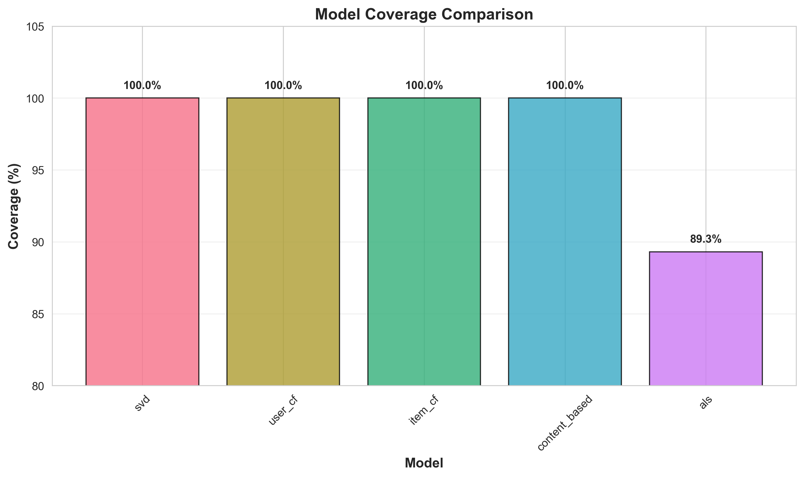
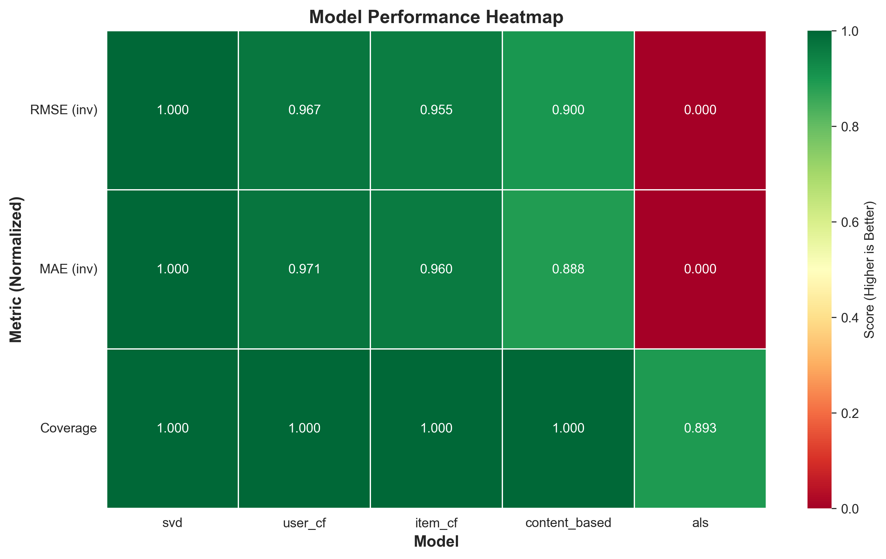
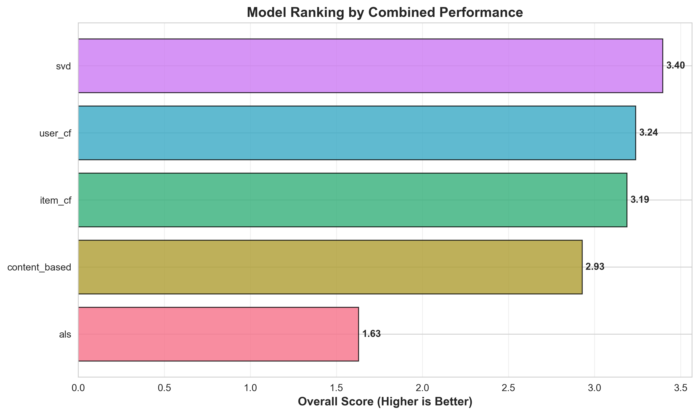

# Recommendation System - Results

## Dataset
- **Dataset**: MovieLens 100K
- **Users**: 943
- **Items**: 1,682 movies
- **Ratings**: 100,000 ratings
- **Rating Scale**: 1-5 stars
- **Sparsity**: ~93.7%

## Model Comparison

### Performance Metrics

Comparison of RMSE and MAE across all implemented recommendation algorithms.

### Coverage Analysis

Coverage percentage showing each model's ability to generate predictions for test users.

## Performance Heatmap

Normalized performance metrics across all models (higher is better).

## Model Ranking

Overall ranking by combined performance score (lower RMSE + lower MAE + higher coverage).

## Results Summary

| Model | RMSE | MAE | Coverage | Predictions |
|-------|------|-----|----------|-------------|
| SVD | 0.950 | 0.744 | 100.0% | 1000 |
| User-CF | 1.013 | 0.799 | 100.0% | 1000 |
| Item-CF | 1.036 | 0.818 | 100.0% | 1000 |
| Content-Based | 1.139 | 0.953 | 100.0% | 1000 |
| ALS | 2.834 | 2.607 | 89.3% | 893 |

## Key Findings

- **Best Model**: SVD (Singular Value Decomposition) achieved the lowest RMSE (0.950) and MAE (0.744) with full coverage
- **Collaborative Filtering**: User-based and item-based CF both performed well with complete coverage
- **Content-Based**: Competitive performance using only item metadata
- **ALS**: Lower coverage (89.3%) and higher error rates, indicating convergence challenges on this dataset

## Performance Analysis

The matrix factorization approach (SVD) outperformed traditional collaborative filtering methods by learning latent factors that capture user preferences and item characteristics. All models except ALS achieved 100% coverage, demonstrating robust prediction capabilities across the test set.
